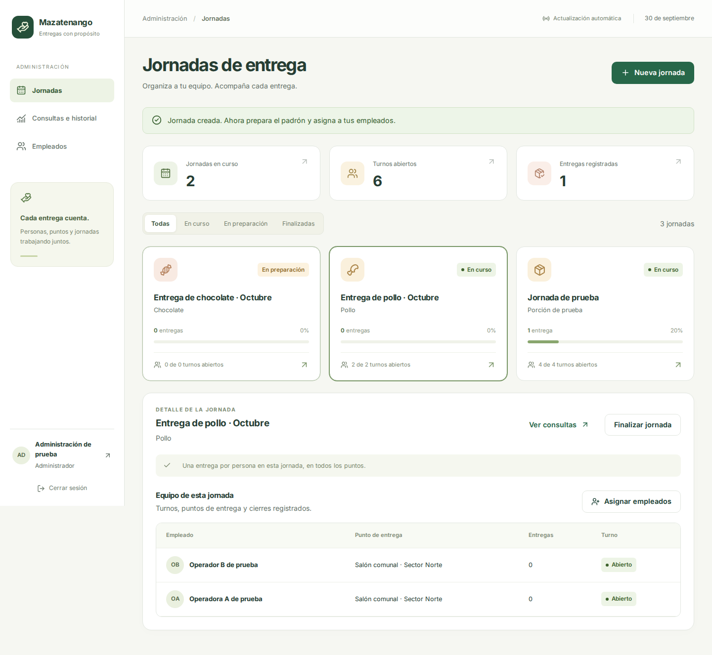
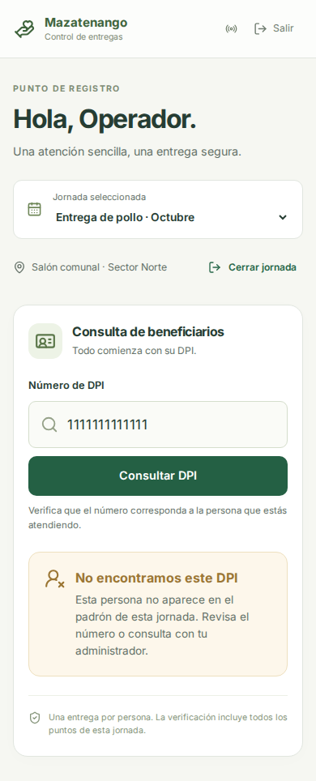
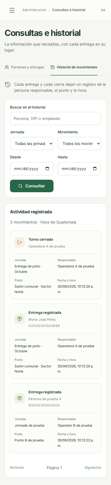

# Interfaz de jornadas

Capturas reales de la aplicación con datos ficticios de las pruebas automatizadas. No incluyen datos del padrón municipal ni credenciales reales.

## Administrador

Tres secciones: Jornadas, Consultas e historial y Empleados. El detalle de la jornada reúne padrón, habilitación, personal, puntos y cierres.

## Empleado

Consulta DPI, disponibilidad, confirmación y cierre de su propio turno. Si no aparece en el padrón, el mensaje permite corregir el número o consultar con administración.

## Historial desde móvil

Las tarjetas conservan responsable, punto, persona y fecha/hora sin comprimir una tabla de escritorio.

